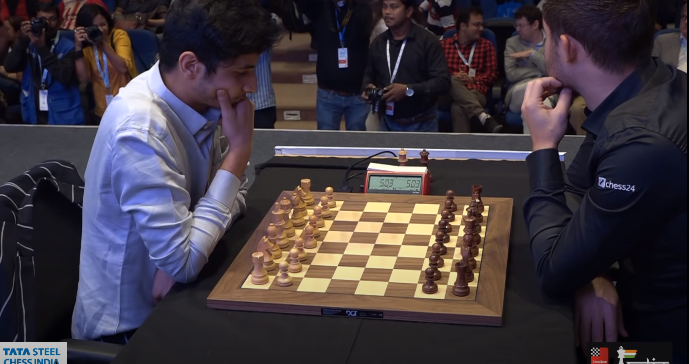
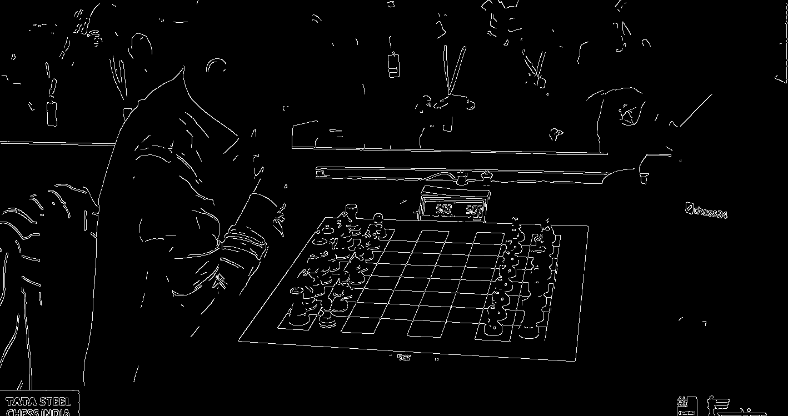
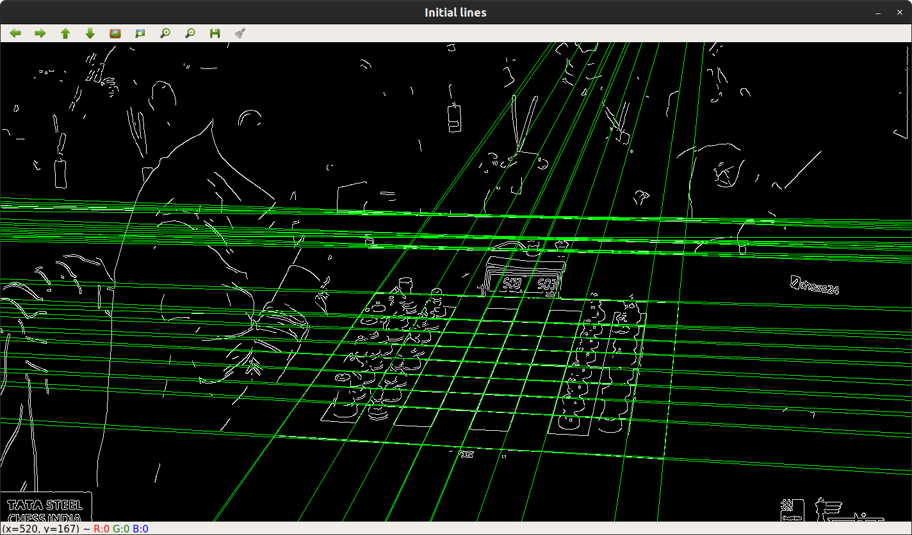
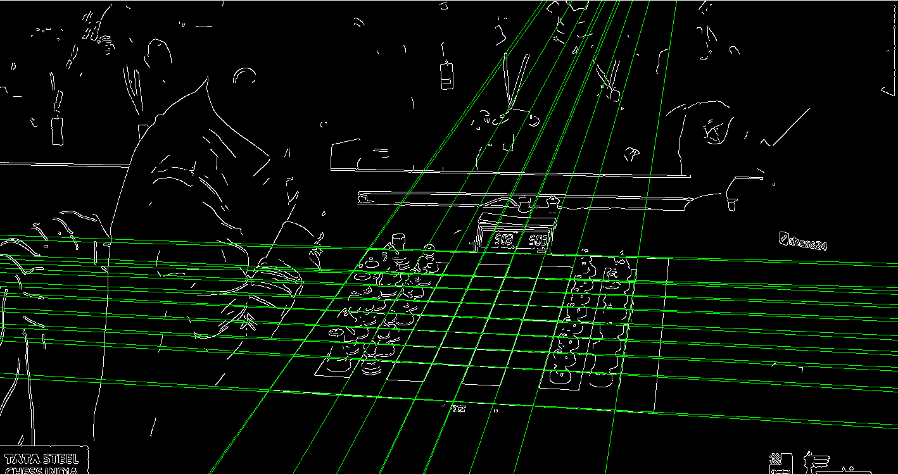
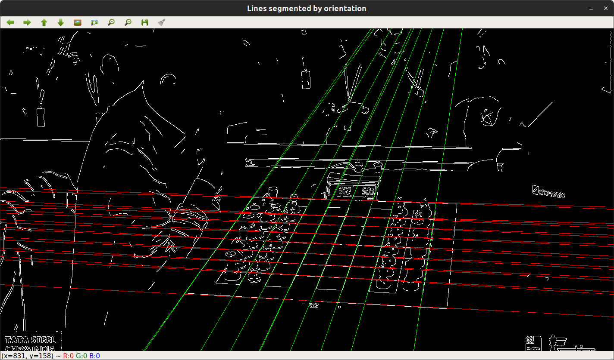
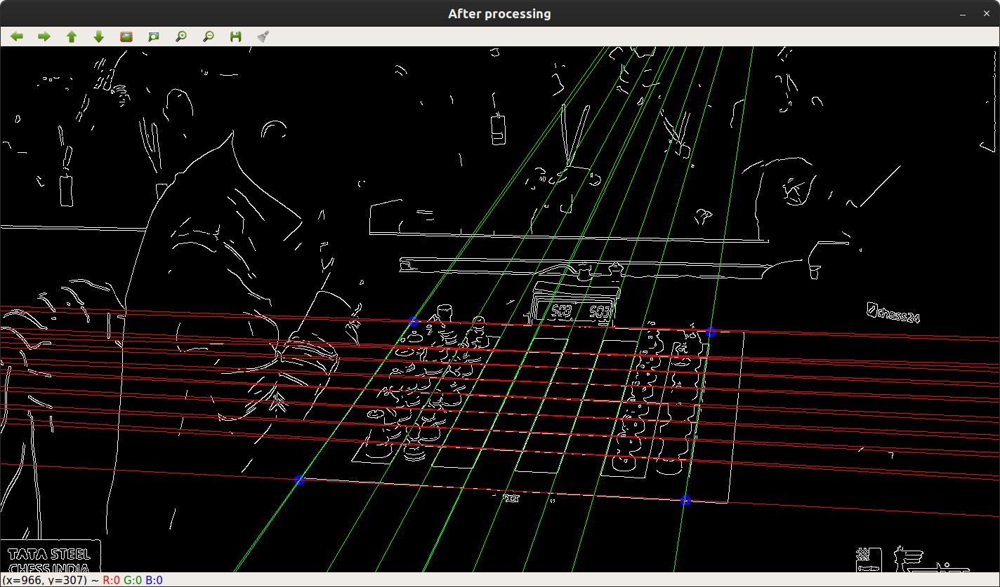
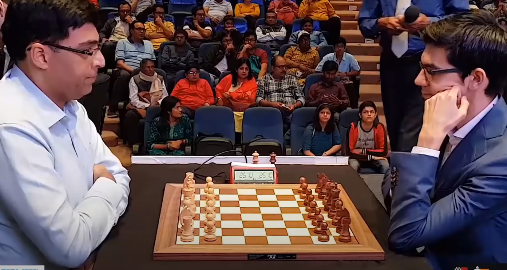
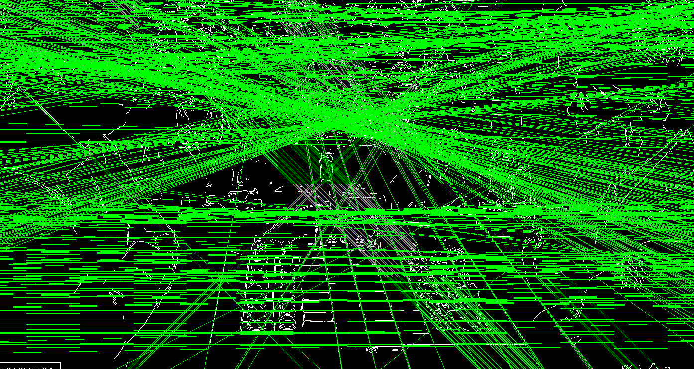
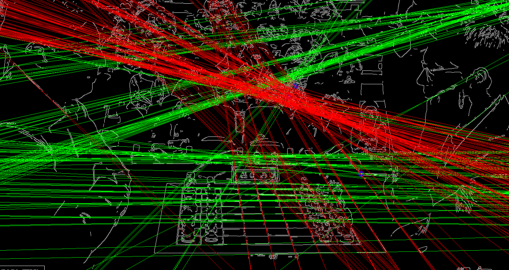

# Part 2 Report

## Data Preprocessing / Feature Extraction

There is no pre-processing done on the data. For feature extraction, we used Canny edge detection and Hough transforms.

## Feature Extraction Methodology

We used Canny edge detection in order to get the horizontal and vertical lines of the chessboard. We used Canny edge detection since it automatically binarizes the image, and creates the edges that facilitate the Hough transform's line findings.

Then, we used Hough line transform to get the coordinates of these lines in polar coordinates. We used the Hough transform since a chessboard has a reliable line pattern with every board being comprised of 9 lines intersected by 9 other lines. Detecting these lines are therefore useful for detecting the chessboard.

Next, we transform the polar coordinates to Cartesian coordinates. After obtaining Cartesian coordinates, we perform a variety of filters on the lines to reduce them to the correct chessboard lines:

1. Filter lines by start/end points, assuming that the chessboard is in the center of the screen.
2. Filter lines by angle.
3. Segment lines by angle k-means clustering according to line angle in order to find intersections.
4. Find corners of chessboard based on intersections.

## Images
This first set of images show correct feature extraction:
Initial image:

Canny edge detection:

Initial lines:

Filtered lines:

Segmented lines:

Corners:

This second set of images show how non-chessboard lines can severely impact the line detection's performance:

The line detection is impacted by the gentleman with the plaid shirt in the center of the image.
Initial lines:

Corners:

